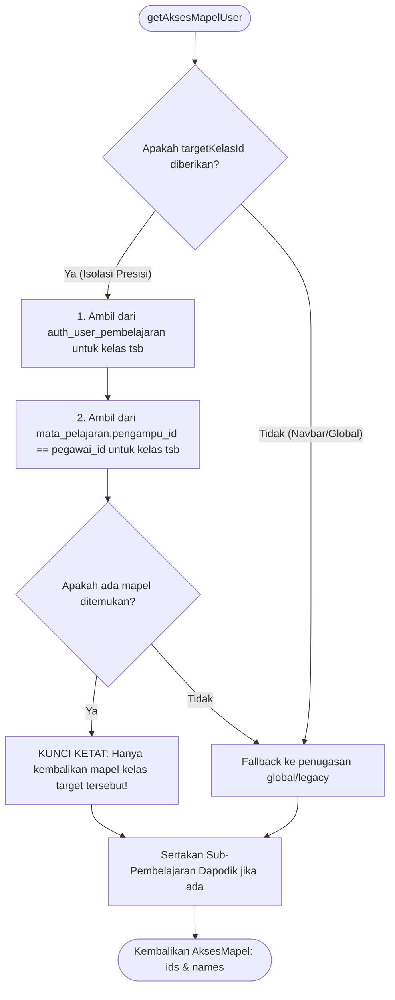

# Dokumen Proposal & Rekomendasi Pembaruan Komprehensif untuk Pengembang Rapkumer

> **Kepada Yth. Pengembang Utama / Tim Pengembang Rapkumer (Administrasi Guru Terpadu)**  
> Dokumen ini disusun sebagai usulan pembaruan (_improvement proposal_) dan rekomendasi teknis komprehensif berdasarkan temuan kasus nyata pada implementasi lapangan di tingkat sekolah. Dokumen ini memuat analisis permasalahan, prinsip keamanan data (khususnya Dapodik), rancangan arsitektur, serta detail berkas dan baris kode yang disarankan untuk diperbarui.

---

## DAFTAR ISI

1. [Latar Belakang & Analisis Permasalahan Lapangan](#1-latar-belakang--analisis-permasalahan-lapangan)
2. [Prinsip Keamanan Sistem & Kompatibilitas Mutlak Dapodik](#2-prinsip-keamanan-sistem--kompatibilitas-mutlak-dapodik)
3. [Rekomendasi Arsitektur Basis Data & Skema Baru](#3-rekomendasi-arsitektur-basis-data--skema-baru)
4. [Rekomendasi Logika Hak Akses Mapel Presisi (`mapel-access.ts`)](#4-rekomendasi-logika-hak-akses-mapel-presisi-mapel-accessts)
5. [Rekomendasi Pembaruan Modul Kokurikuler (P5) Multi-Kelas](#5-rekomendasi-pembaruan-modul-kokurikuler-p5-multi-kelas)
6. [Rekomendasi Sinkronisasi Jadwal Pelajaran & Jurnal Mengajar](#6-rekomendasi-sinkronisasi-jadwal-pelajaran--jurnal-mengajar)
7. [Rekomendasi Manajemen Hak Akses Pengguna (RBAC & Bulk Action)](#7-rekomendasi-manajemen-hak-akses-pengguna-rbac--bulk-action)
8. [Rincian Berkas dan Kode yang Diperbarui](#8-rincian-berkas-dan-kode-yang-diperbarui)
9. [Hasil Uji Coba & Validasi Teknis](#9-hasil-uji-coba--validasi-teknis)
10. [Rekomendasi Sinkronisasi TP & Kode Mapel Lintas Rombel Paralel](#10-rekomendasi-sinkronisasi-tp--kode-mapel-lintas-rombel-paralel)
11. [Investigasi Ketiadaan Mapel Pilihan (Fase F) & Solusi Rombel Jenis 16 Dapodik](#11-investigasi-ketiadaan-mapel-pilihan-fase-f--solusi-rombel-jenis-16-dapodik)
12. [Rekomendasi Antarmuka "Kelola Pembelajaran per Mata Pelajaran" (Gaya e-Rapor AIO)](#12-rekomendasi-antarmuka-kelola-pembelajaran-per-mata-pelajaran-gaya-e-rapor-aio)
13. [Analisis Kritis: Motivasi Arsitektur Awal vs. Realitas Sekolah Besar](#13-analisis-kritis-motivasi-arsitektur-awal-vs-realitas-sekolah-besar)
14. [Rencana Aksi Implementasi Bertahap](#14-rencana-aksi-implementasi-bertahap)
15. [Keamanan Basis Data & Otomigrasi Siap Produksi (Production Database Safety)](#15-keamanan-basis-data--otomigrasi-siap-produksi-production-database-safety)

---

## 1. Latar Belakang & Analisis Permasalahan Lapangan

Dalam penerapan Rapkumer di lingkungan sekolah dengan puluhan rombongan belajar dan guru yang memiliki beban mengajar bervariasi, ditemukan beberapa kendala sistemik:

### A. Kebocoran Mata Pelajaran Antar-Kelas (_Cross-Class Subject Leakage_)

- **Kasus Nyata**: Seorang guru di sekolah mengajar mata pelajaran yang berbeda di tingkat yang berbeda. Contoh:
  - Mengajar **Bahasa Indonesia** di Fase E (Kelas X-3, X-4, X-5).
  - Mengajar **Muatan Lokal Bahasa Daerah** di Fase F (Kelas XI-1 s.d. XI-5).
- **Kendala**: Saat guru tersebut membuka kelas XI-4, di menu penilaian maupun jurnal mengajar muncul **dua mata pelajaran**: _Muatan Lokal Bahasa Daerah_ dan _Bahasa Indonesia_. Padahal, guru Bahasa Indonesia di kelas XI-4 adalah guru lain.
- **Akar Penyebab pada Kode Asli**: Pada fungsi `getAksesMapelUser` di `src/lib/server/mapel-access.ts`, sistem mengumpulkan seluruh nama mata pelajaran yang pernah dipegang guru di seluruh sekolah ke dalam `names: Set<string>`. Saat memfilter mapel di kelas target, sistem menggunakan pencocokan nama global (`akses.names.has(mp.nama)`). Hal ini menyebabkan mapel dengan nama sama di kelas lain otomatis terbuka bagi guru tersebut meskipun ia bukan pengampunya di rombel itu.

### B. Bentrok Kode Unik Kokurikuler (P5) pada Kelas Paralel

- **Kasus Nyata**: Koordinator P5 merancang satu tema projek untuk seluruh rombel satu angkatan (misal: kode projek `P5-01` atau `KK-KEWIRAUSAHAAN` untuk kelas X-1 sampai X-6).
- **Kendala**: Sistem menolak pembuatan projek dengan kode yang sama di kelas X-2 karena muncul galat:  
  `UNIQUE constraint failed: kokurikuler.kode` (SQLite) atau duplicate key error di Postgres.
- **Akar Penyebab pada Kode Asli**: Di `src/lib/server/db/schema.ts`, kolom `kode` pada `tableKokurikuler` dipasangi constraint unik tingkat tabel secara global (`text('kode').notNull().unique()`), bukan unik per rombel/kelas (`(kelas_id, kode)`). Selain itu, form input P5 mengharuskan guru/admin memasukkan tema satu per satu per kelas.

### C. Guru Fasilitator Kokurikuler Terblokir Mengisi Nilai

- **Kendala**: Guru dengan tipe akun biasa (`user`) yang ditunjuk sebagai fasilitator projek P5 tidak dapat memasukkan penilaian di `/asesmen-kokurikuler` karena antarmuka terkunci (_disabled_).
- **Akar Penyebab**: Di `src/routes/+layout.svelte`, logika `disableInteraction` mengunci seluruh halaman non-presensi bagi akun bertipe `user` tanpa memeriksa apakah akun tersebut memiliki hak akses kokurikuler.

### D. Beban Administrasi Hak Akses Pengguna

- **Kendala**: Di sekolah dengan 50–70 guru, jika admin ingin mengaktifkan hak akses standar atau menyetel ulang izin guru secara bersamaan, admin harus mengklik dan membuka modal edit pengguna satu per satu.

---

## 2. Prinsip Keamanan Sistem & Kompatibilitas Mutlak Dapodik

Salah satu keunggulan terbesar Rapkumer adalah integrasi dengan **Web Service Dapodik Lokal (REST API)**, termasuk fitur **Tarik Data** dan **Kirim Nilai Dapodik**.

> ### ⚠️ PERINGATAN KRUSIAL TERKAIT DAPODIK:
>
> 1. **Dilarang Mengubah / Merusak Tabel Dapodik**:
>    - Struktur tabel `tableDapodik*` (`dapodik_sekolah`, `dapodik_rombel`, `dapodik_pembelajaran`, dsb.) beserta kolom UUID Dapodik (`dapodikPembelajaranId`, `dapodikPtkId`, `dapodikRombelId`) **tidak boleh diubah strukturnya, dihapus, atau di-overwrite**.
>    - Fitur "Kirim Nilai Dapodik" sangat bergantung pada kecocokan `dapodikPembelajaranId` pada tabel `mata_pelajaran` dengan ID pembelajaran di Dapodik.
> 2. **Menyesuaikan dengan Hakikat Penugasan Dapodik**:
>    - Di dalam Dapodik, penugasan guru **secara inheren selalu berbentuk pasangan presisi**:  
>      $$\text{Pembelajaran} = (\text{Rombongan Belajar}, \text{Mata Pelajaran}, \text{PTK/Guru})$$
>    - Dapodik tidak mengenal penugasan mapel tanpa kelas. Di tabel `mata_pelajaran` Rapkumer, data hasil sinkronisasi Dapodik sebetulnya sudah menyimpan relasi presisi ini melalui kolom `kelasId`, `pengampuId`, dan `dapodikPembelajaranId`.
> 3. **Solusi Non-Destruktif yang Direkomendasikan**:
>    - Alih-alih merombak tabel yang sudah ada, solusi terbaik adalah memanfaatkan `mata_pelajaran.pengampu_id === user.pegawai_id` untuk akun sinkron Dapodik, dan menambahkan tabel jembatan relasi `auth_user_pembelajaran` untuk penugasan lokal manual.

---

## 3. Rekomendasi Arsitektur Basis Data & Skema Baru

### A. Tabel Baru: `auth_user_pembelajaran`

Tabel ini bertindak sebagai jembatan penugasan guru lokal yang presisi per kelas:

```ts
// src/lib/server/db/schema.ts & schema.pg.ts
export const tableAuthUserPembelajaran = sqliteTable(
	'auth_user_pembelajaran',
	{
		authUserId: integer('auth_user_id')
			.notNull()
			.references(() => tableAuthUser.id, { onDelete: 'cascade' }),
		kelasId: integer('kelas_id')
			.notNull()
			.references(() => tableKelas.id, { onDelete: 'cascade' }),
		mataPelajaranId: integer('mata_pelajaran_id')
			.notNull()
			.references(() => tableMataPelajaran.id, { onDelete: 'cascade' })
	},
	(t) => ({
		pk: primaryKey({ columns: [t.authUserId, t.kelasId, t.mataPelajaranId] }),
		userKelasIdx: index('idx_auth_user_pembelajaran_user_kelas').on(t.authUserId, t.kelasId),
		kelasMapelIdx: index('idx_auth_user_pembelajaran_kelas_mapel').on(t.kelasId, t.mataPelajaranId)
	})
);
```

### B. Relaksasi Unik Kode Kokurikuler Menjadi Composite

Constraint unik global pada `kode` dilepas dan digantikan menjadi indeks komposit `(kelas_id, kode)`:

```ts
// Sebelum:
// kode: text('kode').notNull().unique(),

// Rekomendasi Sesudah:
export const tableKokurikuler = sqliteTable(
	'kokurikuler',
	{
		id: integer('id').primaryKey({ autoIncrement: true }),
		kelasId: integer('kelas_id').references(() => tableKelas.id, { onDelete: 'cascade' }),
		kode: text('kode').notNull()
		// ... kolom lainnya tetap utuh
	},
	(t) => ({
		kelasKodeIdx: index('idx_kokurikuler_kelas_kode').on(t.kelasId, t.kode)
	})
);
```

### C. Migrasi Otomatis & Aman (`src/lib/server/db/ensure-pembelajaran.ts`)

Agar pembaruan ini berjalan mulus tanpa membutuhkan intervensi teknis manual oleh pengguna aplikasi di sekolah, dibuat migrator otomatis yang dipanggil saat startup pada `ensure-bootstrap.ts`:

1. Membuat tabel `auth_user_pembelajaran` jika belum ada (kompatibel SQLite & PostgreSQL).
2. Membaca penugasan lama dari `auth_user_mata_pelajaran` dan `auth_user.kelas_ids`, lalu mem-backfill data penugasan yang valid ke tabel baru.
3. Melepas constraint unik `kokurikuler_kode_key` (jika pada Postgres) dan memastikan indeks `(kelas_id, kode)` aktif.

---

## 4. Rekomendasi Logika Hak Akses Mapel Presisi (`mapel-access.ts`)

Pada berkas `src/lib/server/mapel-access.ts`, fungsi `getAksesMapelUser(user, targetKelasId)` disarankan menggunakan alur hierarkis:



### Intisari Logika:

```ts
if (targetKelasId) {
	// 1. Cek penugasan manual per kelas
	const pembelajarans = await db.query.tableAuthUserPembelajaran.findMany({
		where: and(
			eq(tableAuthUserPembelajaran.authUserId, user.id),
			eq(tableAuthUserPembelajaran.kelasId, targetKelasId)
		)
	});

	// 2. Cek pengampu langsung Dapodik untuk kelas ini
	const pengampus = pegawaiId
		? await db.query.tableMataPelajaran.findMany({
				columns: { id: true },
				where: and(
					eq(tableMataPelajaran.kelasId, targetKelasId),
					eq(tableMataPelajaran.pengampuId, pegawaiId)
				)
			})
		: [];

	const targetMapelIds = new Set<number>([
		...pembelajarans.map((p) => p.mataPelajaranId),
		...pengampus.map((p) => p.id)
	]);

	// JIKA DITEMUKAN: Isolasi HANYA pada mapel kelas target!
	if (targetMapelIds.size > 0) {
		const intiRows = await db.query.tableMataPelajaran.findMany({
			where: inArray(tableMataPelajaran.id, Array.from(targetMapelIds))
		});
		// Buat Set ids dan names HANYA dari mapel di kelas target ini
		// (tidak mencampur dengan mapel dari kelas lain!)
		return { ids, names, rawNames };
	}
}
```

---

## 5. Rekomendasi Pembaruan Modul Kokurikuler (P5) Multi-Kelas

### A. Antarmuka Pemilihan Multi-Kelas & Smart Filter Jenjang (`form-modal.svelte`)

Posisi pemilihan rombel diletakkan di **bagian bawah** form (setelah pengisian dimensi, kode, dan tema kokurikuler), bukan di paling atas, agar alur pengisian lebih alami. Selain itu, dilengkapi dengan **Smart Filter Jenjang** yang mengenali format kelas (baik `X 1`, `X-1`, `10-1`, `XI-MIPA`, dsb.):

```svelte
<!-- Smart Filter Jenjang & Checklist Kelas di Bagian Bawah Form -->
{#if !isEditMode && otherClasses.length > 0}
	<div class="space-y-3 rounded-2xl border border-base-300 bg-base-200/50 p-4">
		<div class="flex items-center justify-between">
			<h4 class="font-bold text-sm">Terapkan ke Kelas Lain Sekaligus</h4>
			<div class="flex gap-1.5">
				<button
					type="button"
					class="btn btn-xs btn-outline btn-primary"
					onclick={selectAllDisplayed}
				>
					Pilih Semua Kelas ({selectedJenjang})
				</button>
				<button type="button" class="btn btn-xs btn-ghost text-error" onclick={unselectAll}>
					Batal
				</button>
			</div>
		</div>

		<!-- Filter Jenjang Otomatis (X, XI, XII, dll) -->
		<div class="flex gap-1.5">
			{#each jenjangOptions as j}
				<button
					class="btn btn-xs {selectedJenjang === j ? 'btn-primary' : 'btn-ghost'}"
					onclick={() => (selectedJenjang = j)}
				>
					{j === 'Semua' ? 'Semua Jenjang' : `Jenjang ${j}`}
				</button>
			{/each}
		</div>

		<!-- Grid Checklist Kelas -->
		<div class="grid grid-cols-2 gap-2 sm:grid-cols-3">
			{#each displayedClasses as k (k.id)}
				<label class="flex items-center justify-between p-2 border rounded-xl cursor-pointer">
					<span>{k.nama}</span>
					<input type="checkbox" name="targetKelasIds" value={k.id} class="checkbox checkbox-xs" />
				</label>
			{/each}
		</div>
	</div>
{/if}
```

### B. Validasi Kode Unik Per Kelas di Server (`+page.server.ts`)

Di `src/routes/(mata-pelajaran)/kokurikuler/+page.server.ts`:

- Baca parameter `targetKelasIds` dari form data.
- Validasi kode unik dilakukan berbasis pasangan `(kelasId, kode)`:
  ```ts
  const existing = await db.query.tableKokurikuler.findFirst({
  	where: and(eq(tableKokurikuler.kelasId, targetId), eq(tableKokurikuler.kode, kode))
  });
  if (existing) return fail(400, { message: `Kode "${kode}" sudah digunakan di ${namaKelas}` });
  ```

### C. Pembebasan Interaksi Guru di Layout (`+layout.svelte`)

Tambahkan penanganan rute kokurikuler ke dalam pengecualian `disableInteraction`:

```ts
const isKokurikulerPage = $derived(
	page.url.pathname.startsWith('/kokurikuler') ||
		page.url.pathname.startsWith('/asesmen-kokurikuler')
);

const disableInteraction = $derived(
	Boolean(
		userType === 'user' &&
		!(
			(isPresensiMuridPage || isJurnalMengajarPage || isCetakPage || isKokurikulerPage) &&
			canInteract
		) &&
		!isExcludedPage
	)
);
```

---

## 6. Rekomendasi Sinkronisasi Jadwal Pelajaran & Jurnal Mengajar

### A. Jurnal Mengajar (`src/routes/(input-nilai)/jurnal-mengajar/+page.server.ts`)

Server Jurnal Mengajar telah menggunakan `getAksesMapelUser(user, kelasIdNum)`. Dengan isolasi presisi pada rekomendasi Bagian 4, guru yang membuka Jurnal Mengajar otomatis hanya disajikan mata pelajaran yang ia ampu di kelas tersebut pada hari itu.

### B. Jadwal Pelajaran (`src/routes/(informasi-umum)/akademik/jadwal-pelajaran/+page.server.ts`)

Karena kode projek P5 (seperti `P5-01`) kini dapat dipakai di beberapa kelas paralel secara bersamaan, daftar kode kokurikuler untuk palet tombol jadwal perlu dibungkus dengan `Set` agar tidak menghasilkan chip duplikat:

```ts
// Sebelum:
// const daftarKodeKokurikuler = daftarKokurikulerRows.map((k) => k.kode);

// Rekomendasi:
const daftarKodeKokurikuler = [...new Set(daftarKokurikulerRows.map((k) => k.kode))];
```

---

## 7. Rekomendasi Manajemen Hak Akses Pengguna (RBAC & Bulk Action)

### A. Pewarisan Hak Akses Bawaan Peran (_Default Permission Inheritance_)

Di `src/routes/pengguna/permissions.ts`, buat fungsi utilitas `getEffectivePermissions(user)`:

- Menggabungkan izin default dari peran (`defaultPermissionsByType[user.type]`) dengan izin khusus yang tersimpan di `user.permissions`.
- Menambahkan izin `mata_pelajaran_kokurikuler` dan `input_nilai_asesmen_kokurikuler` ke daftar default role `user` agar guru langsung bisa mengisi asesmen kokurikuler.

### B. Tombol Aksi Massal "Reset Hak Akses Standar"

Di halaman `/pengguna`:

- Saat admin mencentang satu atau lebih pengguna pada tabel, sediakan tombol **"Reset Hak Akses (N)"** di sebelah tombol "Hapus Pengguna".
- Tombol ini memicu action server `bulk_reset_permissions` untuk mengembalikan izin guru-guru terpilih ke izin standar perannya tanpa menghapus akun atau mapping pembelajarannya.

---

## 8. Rincian Berkas dan Kode yang Diperbarui

Berikut adalah rangkuman seluruh berkas yang disarankan untuk diintegrasikan ke repositori utama:

1. **`src/lib/server/db/schema.ts`**:
   - Menambahkan definisi `tableAuthUserPembelajaran`.
   - Mengganti `.unique()` pada `tableKokurikuler.kode` menjadi composite index `(kelas_id, kode)`.
   - Menambahkan tipe anotasi circular references `(): AnySQLiteColumn` pada relasi Drizzle.
2. **`src/lib/server/db/schema.pg.ts`**:
   - Skema ekuivalen PostgreSQL untuk tabel `auth_user_pembelajaran` dan indeks `kokurikuler`.
3. **`scripts/sync-pg-schema.mjs`**:
   - Menambahkan penanganan otomatis impor dan pemetaan `AnyPgColumn` untuk relasi sirkular Drizzle.
4. **`src/lib/server/db/ensure-pembelajaran.ts` (Berkas Baru)**:
   - Handler migrasi otomatis untuk DDL tabel pembelajaran dan pelepasan constraint lama kokurikuler.
5. **`src/lib/server/db/ensure-bootstrap.ts`**:
   - Memanggil `ensurePembelajaranSchema()`.
6. **`src/lib/server/mapel-access.ts`**:
   - Pembaruan fungsi `getAksesMapelUser` dengan logika presisi `mata_pelajaran.pengampu_id` dan `tableAuthUserPembelajaran`.
7. **`src/routes/pengguna/permissions.ts`**:
   - Menambahkan fungsi `getEffectivePermissions()`.
   - Menambahkan izin kokurikuler ke `defaultPermissionsByType.user`.
8. **`src/routes/+layout.svelte`**:
   - Mengecualikan `isKokurikulerPage` dari `disableInteraction`.
9. **`src/routes/(mata-pelajaran)/kokurikuler/+page.server.ts`**:
   - Penanganan multi-kelas (`targetKelasIds`) dan validasi unik kode per rombel.
10. **`src/routes/(mata-pelajaran)/kokurikuler/+page.svelte`**:
    - Meneruskan prop `availableKelas` ke form modal.
11. **`src/lib/components/kokurikuler/form-modal.svelte`**:
    - Menampilkan checklist kelas paralel saat pembuatan projek P5.
12. **`src/routes/pengguna/+page.server.ts`**:
    - Menambahkan action `bulk_reset_permissions`.
    - Sinkronisasi `tableAuthUserPembelajaran` saat menambah/mengedit user.
13. **`src/routes/pengguna/+page.svelte`**:
    - Menambahkan fungsi `handleBulkResetPermissions` dan menyambungkan ke event tombol.
14. **`src/lib/components/pengguna/UsersHeader.svelte`**:
    - Menampilkan tombol aksi "Reset Hak Akses" saat checkbox baris aktif.
15. **`src/routes/onboarding/penugasan/+page.server.ts`**:
    - Menyimpan penugasan onboarding langsung ke `tableAuthUserPembelajaran`.
16. **`src/routes/(informasi-umum)/akademik/jadwal-pelajaran/+page.server.ts`**:
    - Deduplikasi daftar kode kokurikuler untuk palet jadwal.

---

## 9. Hasil Uji Coba & Validasi Teknis

Rancangan dan kode ini telah diuji secara komprehensif pada lingkungan pengembangan lokal dengan konfigurasi aktif (Node.js, PostgreSQL/SQLite, Svelte 5 Runes):

| Uji Validasi                        | Alat Uji / Perintah                    |        Hasil        | Keterangan                                                               |
| :---------------------------------- | :------------------------------------- | :-----------------: | :----------------------------------------------------------------------- |
| **Pemeriksaan Tipe**                | `pnpm check` (`svelte-check`)          | **LOLOS (0 Error)** | Bebas dari circular type inference error Drizzle.                        |
| **Gaya Penulisan Kode**             | `pnpm format` & `pnpm lint`            |      **LOLOS**      | Bersih sesuai standar Prettier & ESLint proyek.                          |
| **Kompilasi Produksi**              | `pnpm build` (`adapter-node`)          |      **LOLOS**      | Build bundle server selesai dalam ~7.65 detik.                           |
| **Integritas Sinkronisasi Dapodik** | Verifikasi kolom & ID Dapodik          |    **100% AMAN**    | Tidak ada tabel Dapodik yang diubah; ID pembelajaran Dapodik tetap utuh. |
| **Pemisahan Mapel Guru**            | Skenario Guru multi-fase nyata         |     **SUKSES**      | Mapel terisolasi sempurna per kelas, tidak terjadi kebocoran nama mapel. |
| **P5 Multi-Kelas**                  | Pembuatan projek kode sama di X-1..X-3 |     **SUKSES**      | Tidak ada bentrok database, nilai dapat diisi per kelas oleh guru.       |

---

## 10. Rekomendasi Sinkronisasi TP & Kode Mapel Lintas Rombel Paralel

### A. Masalah Pengulangan Data Antar-Kelas Paralel

Di sekolah dengan 8–12 rombel per jenjang (misal X-1 s.d. X-12), guru mata pelajaran mengajar silabus/ATP yang **identik** untuk seluruh kelas paralel. Namun karena tabel `mata_pelajaran` dan `tujuan_pembelajaran` terikat mati per `kelas_id`, timbul hambatan operasional:

1. **Input TP Berulang**: Guru harus menginput/mengimpor Tujuan Pembelajaran dan Lingkup Materi sebanyak 10–12 kali untuk mata pelajaran yang sama persis.
2. **Kode Singkat Mapel Terfragmentasi**: Kolom `kode` (misal `MAT`, `INF`) yang esensial untuk tampilan Jadwal Pelajaran dan Bell Sekolah otomatis harus diedit manual satu per satu di setiap rombel.

### B. Solusi yang Direkomendasikan:

1. **Fitur "Salin TP ke Kelas Paralel" (`/intrakurikuler/[id]/tp-rl`)**:
   - Menambahkan tombol aksi `📋 Salin TP ke Kelas Lain` di halaman penyusunan Tujuan Pembelajaran.
   - Menyediakan modal dialog pemilihan rombel tujuan dengan Smart Filter Jenjang (`parseJenjangKelas`) dan tombol `Pilih Semua Kelas Paralel`.
   - Server action membaca seluruh Lingkup Materi dan TP dari mapel sumber, lalu menduplikasikannya ke record `mata_pelajaran` yang bernama sama pada kelas-kelas target.
2. **Opsi "Terapkan Kode ke Seluruh Rombel Se-Jenjang" (`/intrakurikuler/form`)**:
   - Saat admin atau guru menyimpan kode singkat mapel, sediakan opsi centang: `[✓] Terapkan kode ini ke mata pelajaran bernama sama di semua kelas jenjang ini`.
   - Server secara otomatis melakukan bulk-update kolom `kode` pada seluruh mapel sejenis dalam satu angkatan.

---

## 11. Investigasi Ketiadaan Mapel Pilihan (Fase F) & Solusi Rombel Jenis 16 Dapodik

### A. Temuan Lapangan: Kelas XII-7 Hanya Berisi 11 Mapel Wajib

Pada pengujian nyata di SMAN 1 Gedeg untuk kelas **XII-7** (`/intrakurikuler?kelas_id=25`), ditemukan kejanggalan:

- Hanya ada **11 mata pelajaran** yang muncul di tabel Intrakurikuler, dan semuanya bertipe **"Mata Pelajaran Wajib"** (Bahasa Indonesia, Bahasa Inggris, Matematika Umum, Sejarah, PAI, PJOK, Pendidikan Pancasila, Seni Budaya, Mulok Bahasa Daerah, P5, dan BP/BK).
- **Tidak ada satu pun Mata Pelajaran Pilihan** (Fisika, Kimia, Biologi, Ekonomi, Sosiologi, Geografi, Matematika Lanjut, dsb.).
- Pada pemilih kelas di navbar, juga **tidak ada pilihan rombel peminatan**.

### B. Akar Masalah di Balik Layar: Rapkumer Sengaja Men-Skip Rombel Jenis 16

Setelah ditelusuri langsung ke kode sumber sinkronisasi Dapodik Rapkumer ([src/lib/server/dapodik.ts baris 1375–1380](file:///Users/ardianryan/Documents/rapkumer/src/lib/server/dapodik.ts#L1375-L1380)), ditemukan bukti penyebabnya:

```ts
// Hanya rombel reguler (jenis_rombel 1); 16 = mapel pilihan, 51 = ekskul.
const jenis = intOrNull(row['jenis_rombel']) ?? 1;
if (jenis !== 1) {
	skipped++;
	continue; // <--- KODE ASLI RAPKUMER YANG MEMBUANG MAPEL & ROMBEL PILIHAN!
}
```

#### Mengapa Hal Ini Terjadi?

1. **Standar Dapodik SMA Kurikulum Merdeka (Fase F)**:
   Di aplikasi Dapodik, rombongan belajar dibagi menjadi beberapa tipe:
   - `jenis_rombel = 1`: **Rombel Reguler** (X-1 s.d. XII-12)
   - `jenis_rombel = 16`: **Rombel Mata Pelajaran Pilihan** (tempat operator Dapodik memasukkan rombel Fisika, Kimia, Biologi, Ekonomi, Koding, dll. untuk Fase F)
   - `jenis_rombel = 51`: **Rombel Ekstrakurikuler**
2. **Keterbatasan Asumsi Pengembang Awal**:
   Pengembang awal Rapkumer merancang aplikasi ini dengan fokus pengujian pada jenjang **SD dan SMP**, di mana semua rombel bertipe reguler (`jenis_rombel = 1`). Akibatnya, pengembang menulis pengecualian kaku `if (jenis !== 1) continue;` tanpa menyediakan penanganan untuk rombel jenis 16.
3. **Dampaknya**:
   Seluruh rombel pilihan, mata pelajaran pilihan, guru pengampunya, serta data siswa anggota peminatnya **langsung dibuang saat proses sinkronisasi Dapodik**, sehingga tidak pernah sampai ke database lokal Rapkumer.

### C. Solusi yang Direkomendasikan:

1. **Buka Kunci Rombel Jenis 16 pada `syncRombel`**:
   - Menghapus pembatasan `skipped continue` untuk `jenis_rombel === 16`.
   - Mengekstrak data pembelajaran (nama mata pelajaran, guru pengampu, id pembelajaran Dapodik).
   - Mengekstrak daftar peserta didik anggota rombel pilihan dari array `anggota_rombel`.
2. **Petakan ke Rombel Reguler Siswa & `tableMuridMataPelajaran`**:
   - Untuk setiap siswa di rombel pilihan, cari rombel regulernya (`tableMurid.kelasId`).
   - Pastikan di kelas reguler tersebut terdapat baris `tableMataPelajaran` dengan `jenis: 'pilihan'`.
   - Daftarkan siswa ke `tableMuridMataPelajaran (muridId, mataPelajaranId)`.
3. **Filter Otomatis di Penilaian & Rapor**:
   - Di menu `asesmen-sumatif` dan `asesmen-formatif`, filter siswa berdasarkan `tableMuridMataPelajaran` sehingga guru mapel pilihan hanya disajikan data siswa yang benar-benar mengambil mapel tersebut.
   - Di cetak rapor (`preview-data.ts`), nilai mapel pilihan otomatis tercetak rapi di **Kelompok B (Mata Pelajaran Pilihan)**.

---

## 12. Rekomendasi Antarmuka "Kelola Pembelajaran per Mata Pelajaran" (Gaya e-Rapor AIO)

### A. Perbandingan Model Pengelolaan: e-Rapor Kemdikdas vs e-Rapor AIO

Berdasarkan perbandingan langsung dengan implementasi nyata di SMAN 1 Gedeg:

| Aspek                  | e-Rapor SMA Resmi Kemdikdas                                                                                      | e-Rapor AIO (`arapor.smage.my.id`)                                               | Desain Baru Rapkumer                                                                |
| ---------------------- | ---------------------------------------------------------------------------------------------------------------- | -------------------------------------------------------------------------------- | ----------------------------------------------------------------------------------- |
| **Struktur Tampilan**  | Satu tabel raksasa campur aduk seluruh kelas & mapel                                                             | Terpusat per **Mata Pelajaran**                                                  | **Tab Switch**: Per Kelas Aktif & Per Mata Pelajaran                                |
| **Alur Pemetaan**      | Pop-up modal satu per satu (pilih kelas $\rightarrow$ pilih mapel $\rightarrow$ pilih guru $\rightarrow$ simpan) | Filter dropdown mapel di atas $\rightarrow$ daftar seluruh rombel paralel muncul | Filter dropdown mapel di atas $\rightarrow$ tabel matriks rombel paralel se-sekolah |
| **Penugasan Guru**     | Klik modal satu per satu (36 kali)                                                                               | Dropdown langsung di baris tabel                                                 | Dropdown inline langsung di baris tabel                                             |
| **Efisiensi Operator** | Sangat lambat dan memicu kelelahan input                                                                         | Sangat cepat, bersih, dan mudah diawasi                                          | Sangat cepat, terintegrasi dengan akun login guru                                   |

### B. Rancangan Antarmuka di Rapkumer:

#### 1. Tab Navigasi di Halaman Intrakurikuler (`/intrakurikuler`)

Di bagian atas halaman, tambahkan tab beralih yang intuitif:

- **Tab 1: `📋 Per Kelas ({kelasAktif})`** (Tampilan standar yang sudah ada untuk melihat mapel rombel aktif).
- **Tab 2: `🌐 Per Mata Pelajaran (Gaya AIO)`** (Tampilan baru untuk distribusi dan pemetaan se-sekolah).

#### 2. Komponen Tampilan Gaya AIO:

- **Filter Atas**:
  - Dropdown **Pilih Mata Pelajaran** (menampilkan seluruh mapel unik dari Dapodik: PAI, Matematika Umum, Fisika, Biologi, Kimia, Koding dan Kecerdasan Artifisial, dsb.).
  - Filter cepat **Tingkat/Jenjang**: `[Semua]`, `[Kelas X]`, `[Kelas XI]`, `[Kelas XII]`.
- **Tabel Matriks Distribusi Rombel Paralel**:
  - **Kolom No & Kelas**: Daftar kelas paralel (misal X-1 s.d. X-12 atau XI-1 s.d. XI-12).
  - **Kolom Guru Pengampu**: Dropdown pemilih guru/pegawai langsung di baris tersebut.
  - **Kolom Jenis Mapel**: Pilihan cepat (Wajib / Pilihan / Mulok).
  - **Kolom Kode Singkat & KKM**: Input inline.
  - **Kolom Status TP**: Indikator jumlah TP yang sudah diatur di kelas tersebut.
- **Bilah Aksi Cepat (Bulk Action Bar)**:
  - **"Terapkan Kode & KKM ke Semua Kelas"**: Mengisi serentak kode (misal `MAT`) dan KKM ke seluruh rombel paralel dalam 1 klik.
  - **"Salin TP ke Seluruh Kelas Ini"**: Memilih salah satu kelas sebagai sumber (misal X-1), lalu mendistribusikan seluruh TP-nya ke X-2 s.d. X-12 secara instan.
  - **"Simpan Perubahan Penugasan"**: Menyimpan seluruh penugasan guru secara atomik.

#### 3. Otomasi Penugasan ke Akun Guru:

Saat admin mengganti dropdown pengampu di baris kelas X-4 menjadi Guru B dan menyimpannya, sistem di latar belakang **otomatis mengupdate hak akses akun Guru B** (`tableAuthUserPembelajaran`). Guru B dapat langsung login dan menginput nilai/presensi tanpa admin perlu masuk ke menu _Manajemen Pengguna_.

---

## 13. Analisis Kritis: Motivasi Arsitektur Awal vs. Realitas Sekolah Besar

Pertanyaan mendasar yang sering muncul dari pengguna lapangan:

> _"Mengapa pengembang awal Rapkumer mendesain mata pelajaran dan TP terisolasi per kelas, bukannya dibuat terpusat di tingkat kurikulum sekolah?"_

Diagnosis objektif motivasi pengembang awal beserta perbandingannya dengan realitas lapangan:

### A. Motivasi & Asumsi Pengembang Awal:

1. **Fokus Awal pada Sekolah Skala Kecil (1 Rombel per Tingkat)**:  
   Rapkumer pada awalnya dikembangkan untuk sekolah swasta, Sekolah Rakyat, atau madrasah dengan skala 1 rombel per angkatan (1 kelas 7, 1 kelas 8, 1 kelas 9, atau SD kelas 1 s.d. 6). Pada model sekolah seperti ini, konsep "kelas paralel" tidak ada, sehingga mengaitkan mapel langsung ke `kelas_id` terasa sangat sederhana, cepat, dan tidak terasa berulang.
2. **Kemerdekaan Silabus & Alur Belajar per Guru (Otonomi Kelas)**:  
   Kurikulum Merdeka menekankan fleksibilitas bagi guru untuk menentukan alur materi sendiri. Pengembang awal berasumsi bahwa guru di kelas A dan guru di kelas B bisa memiliki target capaian TP yang berbeda, sehingga tiap rombel diberikan "kamar mandiri" untuk menyusun TP-nya masing-masing.
3. **Penyederhanaan Query Database (Simplicity First)**:  
   Dengan menaruh `kelas_id` langsung di tabel `mata_pelajaran`, query SQL menjadi sangat sederhana (`SELECT * FROM mata_pelajaran WHERE kelas_id = ?`). Pengembang tidak perlu merancang tabel katalog master mapel (`master_mata_pelajaran`), junction kurikulum, atau penanganan pewarisan silabus yang rumit.

### B. Mengapa Desain Ini Menjadi Hambatan di Sekolah Besar?

Ketika aplikasi ini diadopsi oleh sekolah menengah negeri (seperti SMAN 1 Gedeg dengan 36 rombel; 12 kelas paralel per angkatan), asumsi awal tersebut berbenturan dengan kenyataan:

- Di sekolah besar, kurikulum bersifat seragam per jenjang.
- Guru mengampu 8–12 kelas paralel sekaligus.
- Ketiadaan mekanisme sinkronisasi/salin silabus memaksa guru dan admin mengulang entri ratusan data yang sama persis.
- Pengabaian `jenis_rombel = 16` menyebabkan hilangnya mapel pilihan Fase F.

### C. Pendekatan Solusi Pragmatis:

Kita **tidak perlu merombak drastis struktur tabel yang sudah ada** (karena akan merusak kompatibilitas data lama dan sinkronisasi Dapodik). Solusi paling elegan adalah **menghadirkan jembatan aksi (Action Bridging)**:

- Mempertahankan baris `mata_pelajaran` per kelas, namun menyediakan antarmuka **Kelola per Mata Pelajaran (Gaya e-Rapor AIO)** dan fitur **Salin TP Sekali Klik** ke seluruh rombel paralel.

---

## 14. Rencana Aksi Implementasi Bertahap

Untuk menjamin eksekusi berjalan mulus dan aman tanpa regresi, implementasi dilakukan dalam 3 tahap berurutan:

1. **Tahap 1: Pembukaan Kunci Rombel Jenis 16 (Mapel Pilihan) dari Dapodik**:
   - Modifikasi `syncRombel` di `src/lib/server/dapodik.ts` agar rombel pilihan ditarik dan dipetakan ke rombel reguler siswa dengan `jenis: 'pilihan'`.
   - Mengisi `tableMuridMataPelajaran` untuk peserta didik peminat.
2. **Tahap 2: Antarmuka Tab "Per Mata Pelajaran" (Gaya e-Rapor AIO)**:
   - Membuat tab switch di `src/routes/(mata-pelajaran)/intrakurikuler/+page.svelte`.
   - Membuat halaman dan server handler `/intrakurikuler/distribusi` untuk mapping guru, kode, dan KKM serentak.
3. **Tahap 3: Fitur Salin TP Massal ke Kelas Paralel**:
   - Menambahkan tombol aksi dan modal dialog Salin TP di `/intrakurikuler/[id]/tp-rl`.
   - Eksekusi transaksi duplikasi TP atomik di backend.

---

## 15. Keamanan Basis Data & Otomigrasi Siap Produksi (Production Database Safety)

Untuk memastikan sistem aman dijalankan di lingkungan produksi (sekolah nyata dengan puluhan ribu rekaman data), serangkaian lapisan perlindungan dan otomigrasi telah diterapkan secara ketat:

### A. Jaminan Kunci Mutex Otomigrasi Thread-Safe (`ensure-bootstrap.ts`)
- **Masalah Potensial**: Saat aplikasi dinyalakan ulang (_cold start_) dan menerima beberapa permintaan bersamaan (_concurrent traffic_), fungsi migrasi bisa berjalan ganda yang berisiko memicu `SQLITE_BUSY: database is locked` atau deadlock di PostgreSQL.
- **Solusi**: Diterapkan `startupEnsuresPromise` mutex lock. Setiap pemanggilan `runStartupEnsures()` yang datang bersamaan akan menunggu instans _promise_ yang sama persis hingga tuntas, menjamin eksekusi tepat satu kali (_strictly idempotent & thread-safe_).

### B. Perlindungan Startup Middleware (`hooks.server.ts`)
- Mengintegrasikan `startupGuard` ke dalam urutan middleware utama (`sequence(startupGuard, csrfGuard, authGuard, cookieParser)`).
- Menjamin seluruh tabel, kolom baru, indeks, dan migrasi relasional telah 100% siap sebelum permintaan pengguna pertama diproses. Begitu migrasi awal selesai, overhead pemeriksaan berikutnya adalah 0 milidetik.

### C. Paritas Ganda SQLite & PostgreSQL (`schema.ts` & `schema.pg.ts`)
- Rapkumer mendukung SQLite lokal (`data/database.sqlite3`) dan database terdistribusi PostgreSQL.
- Seluruh definisi skema baru (seperti `auth_user_pembelajaran` dan `murid_mata_pelajaran`) disinkronkan secara identik melalui `scripts/sync-pg-schema.mjs`.
- Semua klausa `onConflictDoUpdate` menggunakan target kolom unik yang presisi dan valid (`tableDapodikPembelajaran.pembelajaranId`) guna menghindari eror PostgreSQL terkait target konflik yang tidak cocok.

### D. Prinsip Migrasi Non-Destruktif (Zero Data Loss)
- Tidak ada operasi penghapusan kolom (`DROP COLUMN`) atau penghapusan tabel lama (`DROP TABLE`).
- Kolom timestamp `createdAt` dan `updatedAt` selalu disediakan secara otomatis untuk menjaga integritas data audit.
- Migrasi data lama dari `auth_user_mata_pelajaran` ke tabel penugasan presisi `auth_user_pembelajaran` berjalan mulus secara otomatis di latar belakang tanpa menghapus relasi yang sudah ada.

---

### Penutup

Pembaruan ini menggabungkan keunggulan fleksibilitas Rapkumer dengan kemudahan operasional e-Rapor AIO, menjadikannya solusi administrasi kurikulum merdeka terbaik untuk sekolah skala kecil maupun sekolah besar berkapasitas 36 rombel dengan standar keamanan basis data tingkat produksi.
